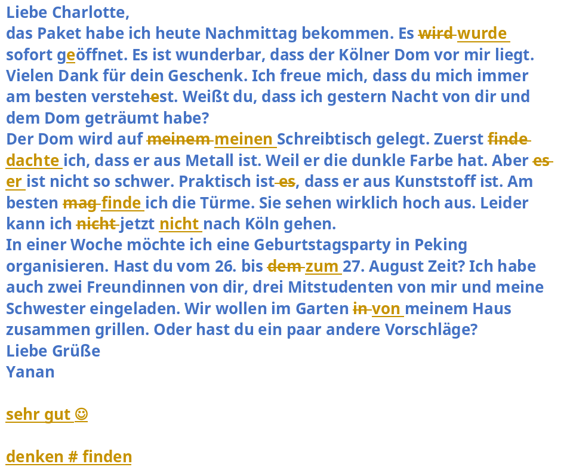

# HA： 02/08/2023
## 原文

`````
Liebe Frau Frei,
meine Lieblingsveranstaltung ist das Joghurtfest in Lhasa, in Tibet. Für 7 Tage kann man Tibeter Theater sehen, auf der Wiese mit Familie zusammen sitzen, und natürlich Joghurt und Pommes frites essen.
Die Veranstaltung findet am 29. Juni im Tibeter Kalender statt. Achtung: Die Tibeter Kalender ist nicht so wie unser normaler Kalender. Seit ein paar hunderte Jahren gibt es schon die Veranstaltung. Das genaue Datum weiß ich leider auch nicht.
Ich war manchmal dort, denn über 6 Jahre habe ich in Lhasa gewohnt. Aber Natur ist interessanter für mich als Kultur in Tibet. Am besten gefällt mir die Landschaft, z.B. die Sonne, der blaue Himmel und die weißen Wolken.
Vor neun Jahren war ich das erste Mal da. Zuerst habe ich drei Freunde im Park am Morgen getroffen. Danach haben wir den gazen Tag geredet, Karten gespielt, Bier getrunken und viel gelacht. Das war lustig.
Wollen Sie nächstes Jahr einen Urlaub zum Joghurtfest machen?
Herzlichen Grüßen
Xxxxx Xx
`````

## 批改

`````
Liebe Frau Frei,
meine Lieblingsveranstaltung ist das Joghurtfest in Lhasa, in Tibet. 7 Tage lang kann man Tibeter Theater sehen, auf der Wiese mit der Familie zusammen sitzen, und natürlich Joghurt und Pommes frites essen.
Die Veranstaltung findet am 29. Juni nach dem Tibeter Kalender statt. Achtung: Der Tibeter Kalender ist nicht so wie unser normaler Kalender. Seit ein paar Hundert Jahren gibt es schon die Veranstaltung. Das genaue Datum weiß ich leider auch nicht.
Ich war manchmal dort, denn über 6 Jahre habe ich in Lhasa gewohnt. Aber Natur ist interessanter für mich als Kultur in Tibet. Am besten gefällt mir die Landschaft, z.B. die Sonne, der blaue Himmel und die weißen Wolken.
Vor neun Jahren war ich das erste Mal da. Zuerst habe ich drei Freunde am Morgen im Park getroffen. Danach haben wir den ganzen Tag geredet, Karten gespielt, Bier getrunken und viel gelacht. Das war lustig.
Wollen Sie nächstes Jahr einen Urlaub in Tibet machen und das Joghurtfest besuchen?
Herzlichen Grüßen
Xxxxx Xx
ok, wenig Fehler
`````

## 对照

`````
Für 7 Tage kann man Tibeter Theater sehen, auf der Wiese mit Familie zusammen sitzen, und natürlich Joghurt und Pommes frites essen.

7 Tage lang kann man Tibeter Theater sehen, auf der Wiese mit der Familie zusammen sitzen, und natürlich Joghurt und Pommes frites essen.
`````

`````
Die Veranstaltung findet am 29. Juni im Tibeter Kalender statt.

Die Veranstaltung findet am 29. Juni nach dem Tibeter Kalender statt.
`````

`````
Seit ein paar hunderte Jahren gibt es schon die Veranstaltung.

Seit ein paar Hundert Jahren gibt es schon die Veranstaltung.
`````

`````
Zuerst habe ich drei Freunde im Park am Morgen getroffen.

Zuerst habe ich drei Freunde am Morgen im Park getroffen.
`````

`````
Wollen Sie nächstes Jahr einen Urlaub zum Joghurtfest machen?

Wollen Sie nächstes Jahr einen Urlaub in Tibet machen und das Joghurtfest besuchen?
`````

`````
Die Tibeter Kalender >>> Der Tibeter Kalender
den gazen Tag >>> den ganzen Tag
`````

# Traumjob

## 原文
`````
Mein Traumjob ist Programmierer, weil mir die Computertechnologie sehr gut gefällt. In der Universität habe ich Informatik studiert. In meiner Freizeit lerne ich auch gern neue Technologien. Es gefällt mir, dass die Software wie meine Idee functioniert. 

Ich möchte gern bei einer großen Firma im Ausland arbeiten, weil eine Firma mit internationalen Kollegen und Kunden interessanter ist. Ich will Menschen aus vielen Ländern kennenlernen. Deshalb ich möchte auch gern ins Ausland viel reisen. 

Angestellt möchte ich lieber als selbstständig sein. Und im Team möchte ich lieber als allein arbeiten. In der Arbeit braucht man oft Hilfe von Kollegen. Mit viele freudlichen Kollegen möchte ich auch gern zusammen arbeiten. 

Dann sind netter Chef und nette Kollegen sehr wichtig. Kein gutes Team gibt es ohne nette Kollegen. Und ich finde es stressig, dass man einen schrecklichen Chef hat. 

Natürlich ist ein guter Lohn auch wichtig, aber Urlaub ist mir wichtiger als der Lohn. Ich finde es wunderschön, dass ich Urlaub sommers mit meiner Familie machen kann. Ohne viel Urlaub geht es nicht. 

Und feste Arbeitszeiten sind mir sehr wichtig. Ich will gar nicht am Wochenende arbeiten, denn ich hasse Überstunden. Ich finde, dass flexible Arbeitszeiten sehr unregelmäßig sind. 

Zum Schluss sind praktische Aufgaben sehr wichtig. Ich arbeite gern. Ich will Erfolg bekommen. Aber ohne praktische Aufgaben sind das unmöglich. 
`````

## 批改

`````
Mein Traumjob ist Programmierer, weil mir die Computertechnologie sehr gut gefällt. In der Universität habe ich Informatik studiert. In meiner Freizeit lerne ich auch gern neue Technologien. Es gefällt mir, dass die Software wie meine Idee funktioniert. 

Ich möchte gern bei einer großen Firma im Ausland arbeiten, weil eine Firma mit internationalen Kollegen und Kunden interessanter ist. Ich will Menschen aus vielen Ländern kennenlernen. Deshalb möchte ich auch gern viel ins Ausland reisen. 

Angestellt möchte ich lieber als selbstständig sein. Und im Team möchte ich lieber als allein arbeiten. In der Arbeit braucht man oft Hilfe von Kollegen. Mit viele freundlichen Kollegen möchte ich auch gern zusammen arbeiten. 

Dann sind ein netter Chef und nette Kollegen sehr wichtig. Es gibt kein gutes Team ohne nette Kollegen. Und ich finde es stressig, dass man einen schrecklichen Chef hat. 

Natürlich ist ein guter Lohn auch wichtig, aber Urlaub ist mir wichtiger als der Lohn. Ich finde es wunderschön, dass ich Urlaub im Sommer mit meiner Familie machen kann. Ohne viel Urlaub geht es nicht. 

Und feste Arbeitszeiten sind mir sehr wichtig. Ich will gar nicht am Wochenende arbeiten, denn ich hasse Überstunden. Ich finde, dass flexible Arbeitszeiten sehr unregelmäßig? sind. 

Zum Schluss sind praktische Aufgaben sehr wichtig. Ich arbeite gern. Ich will Erfolg haben. Aber ohne praktische Aufgaben ist das unmöglich.

gut, wenig Fehler
`````

另外wie meine Idee、unregelmäßig sein，老师看不懂，用特殊颜色标出来了。

## 对照

`````
functioniert -> funktioniert
freudlichen -> freundlichen
拼写错误

Deshalb ich möchte auch gern ins Ausland viel reisen. 
Deshalb möchte ich auch gern viel ins Ausland reisen. 

Dann sind netter Chef und nette Kollegen sehr wichtig. Kein gutes Team gibt es ohne nette Kollegen.
Dann sind ein netter Chef und nette Kollegen sehr wichtig. Es gibt kein gutes Team ohne nette Kollegen. 
看老师的修改，似乎是建议es gibt不要倒装了。

Ich finde es wunderschön, dass ich Urlaub sommers mit meiner Familie machen kann.
Ich finde es wunderschön, dass ich Urlaub im Sommer mit meiner Familie machen kann.

Ich arbeite gern. Ich will Erfolg bekommen. Aber ohne praktische Aufgaben sind das unmöglich. 
Ich arbeite gern. Ich will Erfolg haben. Aber ohne praktische Aufgaben ist das unmöglich.
`````

# ReflexiveVerben

`````
· sich fühlen
Ich fühle mich heute fit, weil ich gestern gut geschlafen habe.

· sich erinnern an + Akk.
Möchtest du dich gern an seine Kinderzeit erinnern?

· sich freuen über + Akk.
Sie freut sich immer über den schönen Herbst.

· sich ärgern über + Akk.
Er ärgert sich nie über die Situation, dass der Zug oft Verspätung hat.
老师修改为：Er ärgert sich nie über die Zugverspätung.

· sich streiten
Tut mir leid. Wir sollen uns nicht mehr streiten. 

· sich verstehen mit + Dat.
Versteht euch bitte bis nächstem Montag mit euren Partnerinnen / Partnern die Grammatik!
老师修改为：nächstem -> nächsten
看例句，都是dem nächsten Montag，然后在这里，dem可以省略

· sich unterhalten mit + Dat.
Sie haben sich gut unterhaltet, weil sie lange nicht gesehen haben.
老师修改为：Sie haben sich gut unterhalten, weil sie sich lange nicht gesehen haben.
也有下面这样的用法，老师给sehen加上的sich应该不是反身代词吧？？？？？？？
Ich habe dich lange nicht gesehen.

· sich ausruhen
Ich will mich am Wochenende gut ausruhen, denn ich so stressig gewesen habe.
老师修改为：Ich will mich am Wochenende gut ausruhen, denn ich so stressig gewesen bin. -> denn ich in letzter Zeit sehr stressig bin.
denn不要求把动词放到最后，估计我一会儿denn一会儿weil，把老师绕晕了。正确的应该如下：
Ich will mich am Wochenende gut ausruhen, denn ich bin in letzter Zeit sehr stressig.
in letzter Zeit 最近

· sich erholen
Erhol dich am Wochenende gut!

· sich beschweren
Er beschweret sich über die kalte Suppe.
老师修改为：Er beschwert sich über die kalte Suppe.

· sich verabreden mit
Sie verabredet sich mit eine Freundin zum Essen im Restaurant.
老师修改为：Smit einer Freundin

· sich schminken
Wir muss uns schnell schminken, weil wir zu spät aufgestanden sind.
老师修改为：muss -> müssen

· sich rasieren
Habt ihr euch heute Morgen rasiert?

· sich umziehen
Wie oft ziehen Sie sich im Sommer um?

· sich anziehen
Ich ziehe mich ein neues T-Shirt an.
老师修改为：Ich ziehe mich. / Ich ziehe mir ein neues T-Shirt an.

· sich ausziehen
Zieh dich bitte deinen Mantel aus, weil es nicht so kalt hier ist.
老师修改为：Zieh dir bitte den Mantel aus, weil es hier nicht so kalt ist.

· sich treffen mit + Dat.
Sie trifft sich mit ihren Freunden auf dem Platz.

· sich interesieren für + Akk.
Wir interesieren uns wirklich für Deutch.
老师修改为：interesieren -> interessieren

· sich beschäftigen mit + Dat.
Ohne gute Erholung kann ich mich nicht mehr nächste Woche mit Deutsch beschäftigen.
`````

# HA： 21/08/2023



<div class="QSA"><Q>finden vs. denken vs. glauben</Q><S></S><A>
glauben: to believe (to be true), also used in a religious sense as "an Gott glauben", "to believe in god"

denken: to think, often used to start a sentence. In those cases, it could be translated as "in my opinion".

finden: "to find", it is also used as "to judge (sth. to be ...)"


All three are used in "Ich finde/denke/glaube/..., dass..." type of sentences, and in those cases, the difference is tiny (if there is any, at all). Just like in english, it is hard to judge what the actual nuances are between "I think/believe".

Additionally, all three words have their own meaning besides that usage obviously, namely "to think", "to find" and "to believe"</A></div>

# 批改

`````
Liebe Charlotte,
das Paket habe ich heute Nachmittag bekommen. Es wurde sofort geöffnet. Es ist wunderbar, dass der Kölner Dom vor mir liegt. Vielen Dank für dein Geschenk. Ich freue mich, dass du mich immer am besten verstehst. Weißt du, dass ich gestern Nacht von dir und dem Dom geträumt habe? 
Der Dom wird auf meinen Schreibtisch gelegt. Zuerst dachte ich, dass er aus Metall ist. Weil er die dunkle Farbe hat. Aber er ist nicht so schwer. Praktisch ist, dass er aus Kunststoff ist. Am besten finde ich die Türme. Sie sehen wirklich hoch aus. Leider kann ich jetzt nicht nach Köln gehen. 
In einer Woche möchte ich eine Geburtstagsparty in Peking organisieren. Hast du vom 26. bis zum 27. August Zeit? Ich habe auch zwei Freundinnen von dir, drei Mitstudenten von mir und meine Schwester eingeladen. Wir wollen im Garten von meinem Haus zusammen grillen. Oder hast du ein paar andere Vorschläge? 
Liebe Grüße
Yanan

sehr gut
`````

# 24/08/2023

`````
Nummer 1: Wo sind die Frau?
Die Frau ist im Park. (wo + Ort => in + Dat.)
Die Frau ist beim Laufen. (wo + Aktivität => bei + Dat.)

Nummer 2: Wo ist die Familie?
Die Familie ist im Park. (wo + Ort => in + Dat.)
Die Familie ist beim Grillen. (wo + Aktivität => bei + Dat.)

Nummer 3: Woher kommen die Kinder?
Die Kinder kommen aus dem Fußballplatz. (woher + Ort => aus + Dat.)
Die Kinder kommen vom Fußballspielen. (woher + Aktivität => von + Dat.)

Nummer 4: Wohin geht das Paar?
Das Paar geht ins Museum. (wohin + Ort => in + Akk.)
Das Paar geht zum Museumbesichtigen. (wohin + Aktivität => zu + Dat.)

Nummer 5: Wohin geht die Frau?
Die Frau geht ins Café. (wohin + Ort => in + Akk.)
Die Frau geht zum Kaffeetrinken. (wohin + Aktivität => zu + Dat.)

Nummer 6: Wo sind die Frauen?
Die Frauen sind im Café. (wo + Ort => in + Dat.)
Die Frauen sind beim Kaffeetrinken. (wo + Aktivität => bei + Dat.)

Nummer 7: Woher kommt der Mann?
Der Mann kommt aus dem Friseursalon. (woher + Ort => aus + Dat.)
Der Mann kommt vom Friseur. (woher + Person => von + Dat.)

Nummer 8: Woher kommt das Kind?
Das Kind kommt aus der Praxis. (woher + Ort => aus + Dat.)
Das Kind kommt vom Artzt. (woher + Person => von + Dat.)

Nummer 9: Wo ist die Person?
Die Person ist im Friseursalon. (wo + Ort => in + Dat.)
Die Person ist beim Friseur. (wo + Person => bei + Dat.)

Nummer 10: Wo ist die Frau?
Die Frau ist in der Praxis. (wo + Ort => in + Dat.)
Die Frau ist beim Artzt. (wo + Person => bei + Dat.)
`````