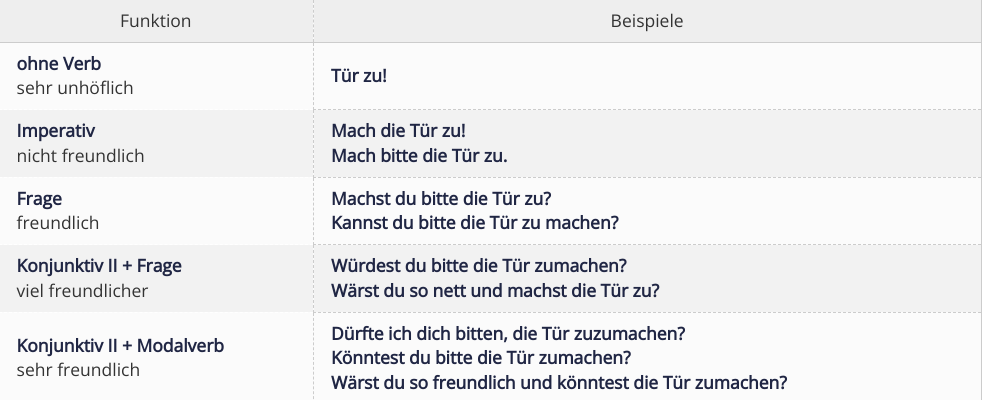

# 参考
`````
https://mein-deutschbuch.de/konjunktiv-2-der-hoeflichkeit.html
`````

# 礼貌程度对比
Der " Konjunktiv II ", die " Modalverben " sowie das Wort "bitte" machen jede Frage / Bitte höflicher.




Die Partikel " vielleicht ", " (ein)mal " und " gern " macht eine Bitte noch höflicher. Beispiele:

